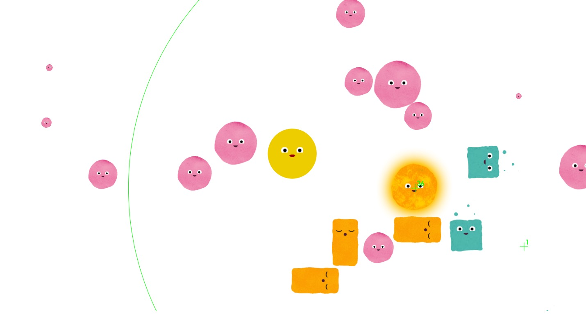

# 互动媒体小游戏

## v0.0.1 made with p5.js

## 在线展示

<https://domonji.github.io/eatsmaller>

## 游戏截图



## 游戏玩法

控制主角吃掉其他小球，如果小球比主角大主角会被小球吃，让主角变成场景中最大的。 绿色的为加速通道，小球碰到会加速，长方形的为障碍，途中发光的为太阳，会吸引周围的小球。小球碰到小球也会相互融合。

## 如何开始游戏

```bash
$ git clone https://github.com/domonji/eatsmaller.git
$ cd eatsmaller
$ npm i
$ npm run start
```
